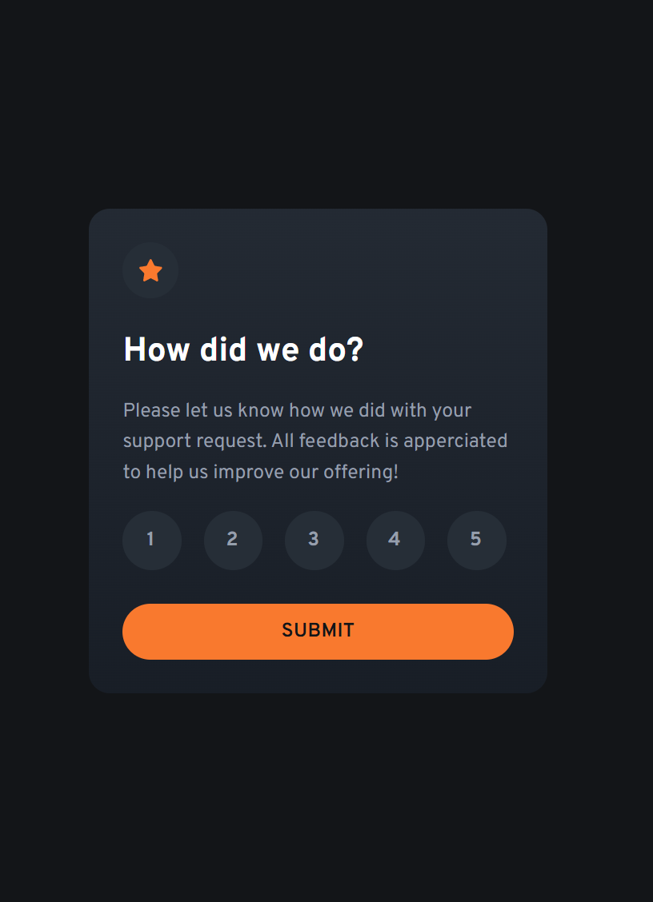
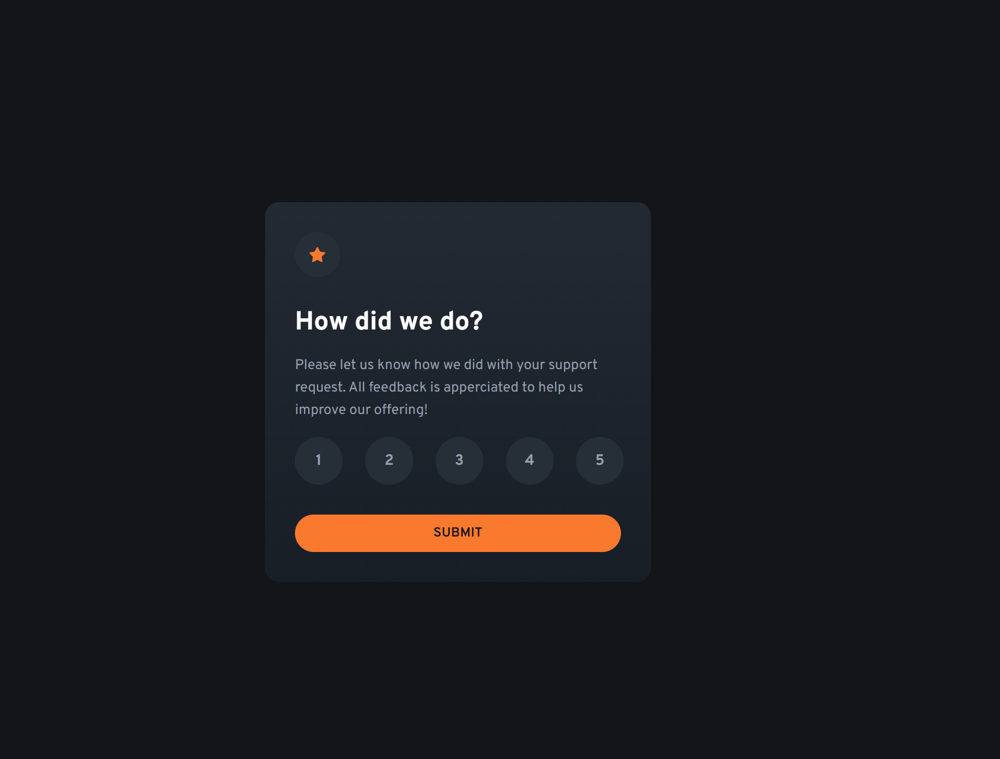
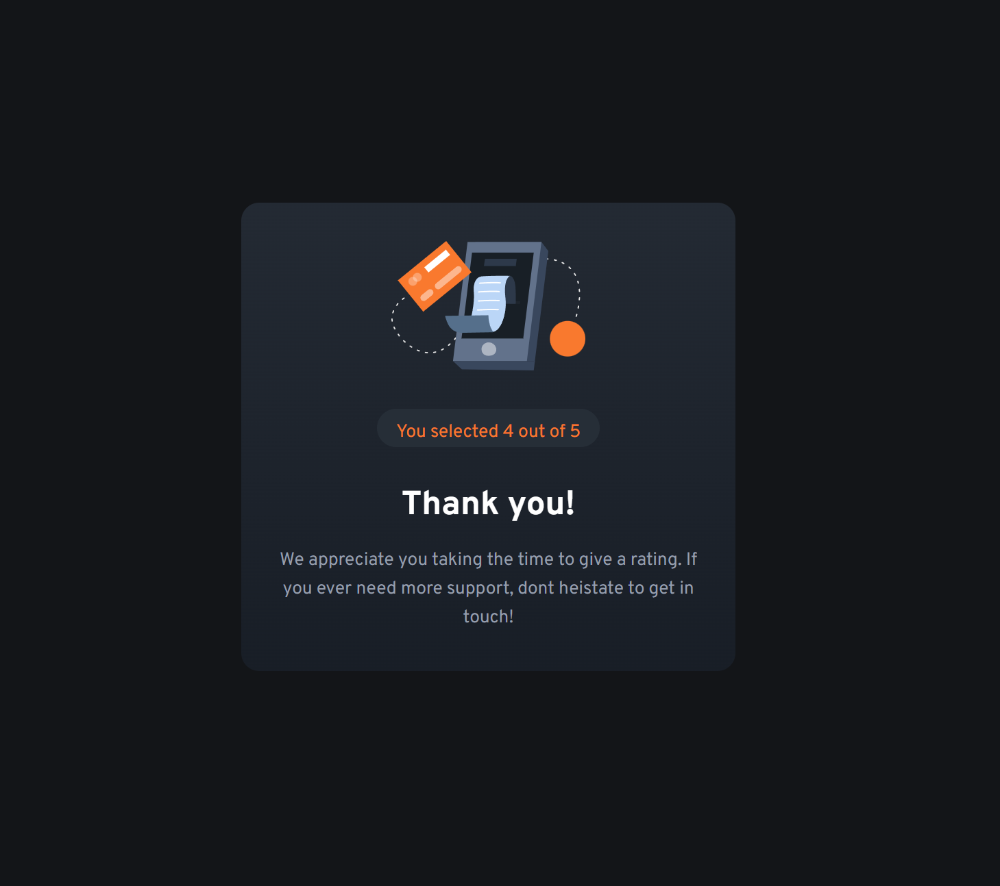

# Interactive Rating Component

This is a solution to the [Interactive Rating Component on Frontend Mentor](https://www.frontendmentor.io/challenges/interactive-rating-component-koxpeBUmI). The challenge consists of developing a rating system component that could be used by a serivce provider to collect data on overall satisfaction level of the provides goods, service, or experience.

## Table of Contents

- [Overview](#overview)
  - [The Challenge](#the-challenge)
  - [Screenshots](#screenshots)
  - [Links](#links)
- [My Process](#my-process)
  - [Built With](#built-with)
  - [What I Learned](#what-i-learned)
  - [Continued Development](#continued-development)
- [Setup](#setup)
- [Author](#author)

## Overview

### The Challenge

Users should be able to:

- Select and submit a service rating from options ranging from 1 through 5.
- See the "Thank you" card state after submitting a rating.
- See hover and focus states for all interactive elements on the page.

### Screenshots

#### Mobile (375px)

#### Tablet/Desktop (768px)

### Links

- Solution URL: [GitHub Repository](https://github.com/bmeinert8/interactive-rating-component/)
- Live Site URL: [Live Demo](https://bmeinert8.github.io/interactive-rating-component/)

## My Process

### Built With

- Semantic HTML5 markup
- CSS custom properties
- Flexbox for layout
- Mobile-first workflow
- Vanilla JavaScript for interactivity
- Git and GitHub for version control

### What I Learned

- Improved my understanding of javascript functionality and creating custom inputs
- Gained experience with JavaScript event listeners and DOM manipulation for dynamic generation.
- Better understanding of using proper semantic html elements.

### Continued Development

I plan to enhance this project with additional features, including:

- Replace alert message with custom modal popup.
- Recreate the rating section as a form using radio buttons and custom styling.
- Implement a temporary cloud database through azure to create a backend for rating storage upon submited rating.

## Setup

To run this project locally:

1. Clone the repository: `git clone https://github.com/your-username/interactive-rating-component.git`
2. Navigate to the project directory: `cd interactive-rating-component`
3. Open `index.html` in a browser, or use a local server (e.g., VS Code Live Server).

## Author

- Name: [Brian Meinert]
- Frontend Mentor: [@bmeinert8](https://www.frontendmentor.io/profile/bmeinert8)
- GitHub: [bmeinert8](https://github.com/bmeinert8)
